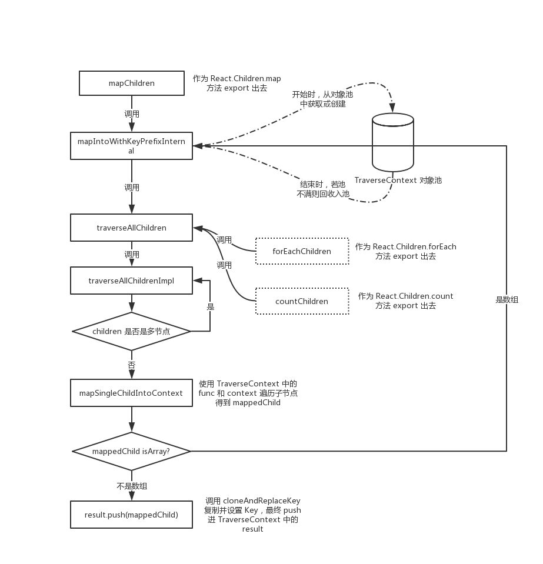

# 对象池模式讲解及在 React 中的应用

> 2019.07.22 发布，最后更新于 2019.07.22

## （一）概念

对象池模式可以理解它为一种特殊的享元模式，这里先对享元模式做介绍。

> 享元（flyweight）模式是一种用于性能优化的模式，“fly”在这里是苍蝇的意思，意为蝇量级。享元模式的核心是运用共享技术来有效支持大量细粒度的对象。
>
> 如果系统中因为创建了大量类似的对象而导致内存占用过高，享元模式就非常有用了。在JavaScript中，浏览器特别是移动端的浏览器分配的内存并不算多，如何节省内存就成了一件非常有意义的事情。
>
> 享元模式要求将对象的属性划分为内部状态与外部状态（状态在这里通常指属性）。享元模式的目标是尽量减少共享对象的数量，关于如何划分内部状态和外部状态，下面的几条经验提供了一些指引：
>
> （1）内部状态存储于对象内部。
>
> （2）内部状态可以被一些对象共享。
>
> （3）内部状态独立于具体的场景，通常不会改变。
>
> （4）外部状态取决于具体的场景，并根据场景而变化，外部状态不能被共享。
>
> 使用享元模式的关键是如何区别内部状态和外部状态。可以被对象共享的属性通常被划分为内部状态，而外部状态取决于具体的场景，并根据场景而变化。

享元模式的应用场景：

> （1）一个程序中使用了大量的相似对象。
>
> （2）由于使用了大量对象，造成很大的内存开销。
>
> （3）对象的大多数状态都可以变为外部状态。
>
> （4）剥离出对象的外部状态之后，可以用相对较少的共享对象取代大量对象。

对象池模式类似享元模式，但对象池模式并不划分内外状态，而只是对已创建的对象进行回收复用。

> 对象池维护一个装载空闲对象的池子，如果需要对象的时候，不是直接new，而是转从对象池里获取。如果对象池里没有空闲对象，则创建一个新的对象，当获取出的对象完成它的职责之后， 再进入池子等待被下次获取。
>
> 对象池技术的应用非常广泛，HTTP 连接池和数据库连接池都是其代表应用。在 Web 前端开发中，对象池使用最多的场景大概就是跟 DOM 有关的操作。很多空间和时间都消耗在了 DOM 节点上，如何避免频繁地创建和删除 DOM 节点就成了一个有意义的话题。

## （二）通用对象池实现

下面是一个通用的对象池模式实现，通过 `objectPoolFactory` 这个函数来创建对象池，对象池具备创建对象方法 `create()` 和对象回收方法 `recover()`：

```js
/**
 * @通用对象池模式
 */
// 对象池工厂
var objectPoolFactory = function(createObjFn) {
  var objectPool = []
  return {
    // 对象池工厂的创建对象方法，首先判断池中是否还有对象，有则将它取出返回，没有则调用 createObjFn 新建
    create: function() {
      var obj = objectPool.length === 0 ?
        createObjFn.apply(this, arguments) : objectPool.shift()
      return obj
    },
    // 对象池工厂的回收方法，将传入的对象回收进对象池
    recover: function(obj) {
      objectPool.push(obj)
    }
  }
}

// 利用 objectPoolFactory 来创建一个装载一些 iframe 的对象池：
var iframeFactory = objectPoolFactory(function() => {
  var iframe = document.createElement('iframe')
  document.body.appendChild(iframe)

  iframe.onload = function() {
    iframe.onload = null;    // Fix：防止 iframe 重复加载的 bug
    iframeFactory.recover(iframe) // iframe 加载完成之后回收节点
  }
  return iframe
})

var iframe1 = iframeFactory.create()
iframe1.src = 'http://baidu.com'

var iframe2 = iframeFactory.create()
iframe2.src = 'http://QQ.com'

window.setTimeout(function() {
  var iframe3 = iframeFactory.create()
  iframe3.src = 'http://163.com'
}, 3000)
```

## （三）分析 React 源码中（ReactChildren.js）对象池模式的运用

React 源码中在实现 [React.Children.map](https://zh-hans.reactjs.org/docs/react-api.html#reactchildrenmap) 方法时运用了对象池模式，
该方法位于 [`ReactChildren.js`](https://github.com/AnHongpeng/react-wisdom/blob/master/packages/react/src/ReactChildren.js) 文件中。

我们首先来看定义对象池和操作对象池方法的地方：

```js
const POOL_SIZE = 10; // PS：对象池中最大缓存数量，池满则不再回收对象
const traverseContextPool = []; // PS：遍历上下文对象池

// PS：获取池化的遍历上下文对象（没有则创建新的对象并返回）
function getPooledTraverseContext(
  mapResult,
  keyPrefix,
  mapFunction,
  mapContext,
) {
  // PS: 若 traverseContext 对象池中有对象，则取出并进行加工返回；若池空了，则创建该对象并返回；
  if (traverseContextPool.length) {
    const traverseContext = traverseContextPool.pop();
    traverseContext.result = mapResult;
    traverseContext.keyPrefix = keyPrefix;
    traverseContext.func = mapFunction;
    traverseContext.context = mapContext;
    traverseContext.count = 0;
    return traverseContext;
  } else {
    return {
      result: mapResult,
      keyPrefix: keyPrefix,
      func: mapFunction,
      context: mapContext,
      count: 0,
    };
  }
}

// PS：将使用后的遍历上下文对象回收进对象池中
function releaseTraverseContext(traverseContext) {
  traverseContext.result = null;
  traverseContext.keyPrefix = null;
  traverseContext.func = null;
  traverseContext.context = null;
  traverseContext.count = 0;
  if (traverseContextPool.length < POOL_SIZE) {
    traverseContextPool.push(traverseContext);
  }
}
```

这里对上面代码中的 `traverseContext` 遍历上下文对象做个讲解（这里有些实现细节不清楚没关系，先了解个大概然后后面会有实现细节的分析）。我们知道 `React.children.map` 方法传入的第二个参数 `func` 和第三个参数 `context`
分别作为遍历子节点的遍历函数以及该遍历函数的上下文，它们被收录在 `traverseContext` 遍历上下文中。除此之外，`traverseContext` 还有 `result`、`keyPrefix`、`count` 三个属性：

1. `result`：后面我们会看到，每当遍历完成一个子节点后，都会将它 `push` 进 `result`，最后整个 `result` 作为 `React.children.map` 方法的返回值返回，而 `React.Children.forEach` 方法中不会用到该属性，这也是 `forEach` 和 `map` 方法的区别；
2. `keyPrefix`：`map` 递归遍历过程中缓存 `KeyPrefix`，最后调用 `cloneAndReplaceKey()` 方法为新 `clone` 的 `ReactElement` 设置 `Key`，并最终 `push` 进 `result` 作为 `map` 结果返回；
3. `count`：遍历过程中累计已遍历的子节点数，它服务于 [React.Children.count](https://zh-hans.reactjs.org/docs/react-api.html#reactchildrencount) 这个 API。

再来概括地看一下上面的代码，这里对象池的运用抽象来看就分为三个阶段：

1. 获取对象：`getPooledTraverseContext()` 根据传入的参数，若对象池中有对象，那么取出来加工（设置对象属性）后返回，若池是空的，那么新创建对象并返回；
2. 使用对象：上面代码中没包含使用对象的地方，下面会给出；
3. 回收对象：`releaseTraverseContext()`，将对象各个属性置空，判断池是否已满，若未满则回收 `push` 进池中，便于之后再取；

下面来逐步看下 `React.Children.map` 遍历节点的实现过程，来加深对应用对象池模式的理解（过程会有些绕，最后放出函数执行流程图）：

```js
/**
 * Maps children that are typically specified as `props.children`.
 *
 * See https://reactjs.org/docs/react-api.html#reactchildrenmap
 *
 * The provided mapFunction(child, key, index) will be called for each
 * leaf child.
 *
 * @param {?*} children Children tree container.
 * @param {function(*, int)} func The map function.
 * @param {*} context Context for mapFunction.
 * @return {object} Object containing the ordered map of results.
 */
function mapChildren(children, func, context) {
  if (children == null) {
    return children;
  }
  const result = [];
  mapIntoWithKeyPrefixInternal(children, result, null, func, context);
  return result;
}
```

`mapChildren` 就是作为 `React.Children.map` 最终 `export` 出去，如果参数 `children` 是 `null` 或 `undefined` 会直接返回，其中调用 `mapIntoWithKeyPrefixInternal()` 进行后续的遍历：

```js
function mapIntoWithKeyPrefixInternal(children, array, prefix, func, context) {
  let escapedPrefix = '';
  if (prefix != null) {
    escapedPrefix = escapeUserProvidedKey(prefix) + '/';
  }
  // PS：从遍历上下文对象池中取对象或创建新的对象返回
  const traverseContext = getPooledTraverseContext(
    array,
    escapedPrefix,
    func,
    context,
  );
  traverseAllChildren(children, mapSingleChildIntoContext, traverseContext);
  releaseTraverseContext(traverseContext);
}
```

`mapIntoWithKeyPrefixInternal()` 中做了4件事，操作对象池方法（获取和回收）也是在该函数中进行：

1. 使用 `escapeUserProvidedKey()` 处理 `prefix`，这里初始的时候传入 `null`，后面会了解到使用 `mapSingleChildIntoContext()` 中如果遍历节点是数组类型还会回过头来调用 `mapIntoWithKeyPrefixInternal()` 并将 `childKey` 传进来；
2. 调用对象池操作方法 `getPooledTraverseContext()`，获取（从池中取或新创建）遍历上下文对象；
3. 调用 `traverseAllChildren()` 进行遍历，这里使用到了上一步获取到的 `traverseContext`；
4. 完成遍历后调用对象池操作方法 `releaseTraverseContext()` 回收遍历上下文对象入池；

下面聚焦来看 `traverseAllChildren()` 函数：

```js
/**
 * Traverses children that are typically specified as `props.children`, but
 * might also be specified through attributes:
 *
 * - `traverseAllChildren(this.props.children, ...)`
 * - `traverseAllChildren(this.props.leftPanelChildren, ...)`
 *
 * The `traverseContext` is an optional argument that is passed through the
 * entire traversal. It can be used to store accumulations or anything else that
 * the callback might find relevant.
 *
 * PS：`traverseContext` 是由整个遍历传进来的可选参数，它用来缓存累积性质的数据或其他与 `callback` 相关联的数据。
 *
 * @param {?*} children Children tree object.
 * @param {!function} callback To invoke upon traversing each child.
 * @param {?*} traverseContext Context for traversal.
 * @return {!number} The number of children in this subtree.
 */
function traverseAllChildren(children, callback, traverseContext) {
  if (children == null) {
    return 0;
  }

  return traverseAllChildrenImpl(children, '', callback, traverseContext);
}
```

PS：虽然我们仅讲解了 `React.Children.map` 方法，但实际上，`React.Children.forEach` 和 `React.Children.count` 都会调用上面的 `traverseAllChildren()` 函数。

`traverseAllChildren()` 函数判断如果 `children` 为 `null` 或 `undefined` 那么直接返回遍历子节点数 0，否则返回调用 `traverseAllChildrenImpl()` 函数的返回值。可想而知，`traverseAllChildrenImpl()` 这个函数返回已遍历的子节点数并且它才是实现遍历的主体函数：

```js
/**
 * @param {?*} children Children tree container.
 * @param {!string} nameSoFar Name of the key path so far.
 * @param {!function} callback Callback to invoke with each child found.
 * @param {?*} traverseContext Used to pass information throughout the traversal
 * process.
 * @return {!number} The number of children in this subtree.
 */
function traverseAllChildrenImpl(
  children,
  nameSoFar,
  callback,
  traverseContext,
) {
  const type = typeof children;

  if (type === 'undefined' || type === 'boolean') {
    // All of the above are perceived as null.
    children = null;
  }

  let invokeCallback = false;

  // PS：第一部分，对 children 进行类型检测，如果是单个可渲染类型（无子节点），则允许并调用 callback 并返回遍历子节点数 1
  if (children === null) {
    invokeCallback = true;
  } else {
    switch (type) {
      case 'string':
      case 'number':
        invokeCallback = true;
        break;
      case 'object':
        switch (children.$$typeof) {
          case REACT_ELEMENT_TYPE:
          case REACT_PORTAL_TYPE:
            invokeCallback = true;
        }
    }
  }

  if (invokeCallback) {
    callback(
      traverseContext,
      children,
      // If it's the only child, treat the name as if it was wrapped in an array
      // so that it's consistent if the number of children grows.
      nameSoFar === '' ? SEPARATOR + getComponentKey(children, 0) : nameSoFar,
    );
    return 1; // 调用一次 callback 并返回遍历子节点数为 1
  }

  // PS：第二部分，如果 children 是数组或其他可遍历数据结构，那么递归调用 traverseAllChildrenImpl 去遍历
  let child;
  let nextName;
  let subtreeCount = 0; // Count of children found in the current subtree.
  const nextNamePrefix =
    nameSoFar === '' ? SEPARATOR : nameSoFar + SUBSEPARATOR;

  if (Array.isArray(children)) { // PS：如果 children 是数组，那么遍历它并递归调用 traverseAllChildrenImpl，子节点计数器累加
    for (let i = 0; i < children.length; i++) {
      child = children[i];
      nextName = nextNamePrefix + getComponentKey(child, i);
      subtreeCount += traverseAllChildrenImpl(
        child,
        nextName,
        callback,
        traverseContext,
      );
    }
  } else { // PS：如果 children 是非数组的可遍历数据结构
    const iteratorFn = getIteratorFn(children);
    if (typeof iteratorFn === 'function') {
      if (__DEV__) {
        // Warn about using Maps as children
        // PS：Map 结构的默认遍历器接口（Symbol.iterator 属性），就是 entries 方法，即 map[Symbol.iterator] === map.entries // true
        if (iteratorFn === children.entries) {
          warning(
            didWarnAboutMaps,
            'Using Maps as children is unsupported and will likely yield ' +
              'unexpected results. Convert it to a sequence/iterable of keyed ' +
              'ReactElements instead.',
          );
          didWarnAboutMaps = true;
        }
      }

      const iterator = iteratorFn.call(children);
      let step;
      let ii = 0;
      while (!(step = iterator.next()).done) { // 使用 while 循环遍历该数据结构，并在过程中递归调用 traverseAllChildrenImpl
        child = step.value;
        nextName = nextNamePrefix + getComponentKey(child, ii++);
        subtreeCount += traverseAllChildrenImpl(
          child,
          nextName,
          callback,
          traverseContext,
        );
      }
    } else if (type === 'object') { // PS：如果 children 是不可遍历的 object 类型，那么开发环境下打印错误日志，subtreeCount 不进行累加，以 0 返回
      let addendum = '';
      if (__DEV__) {
        addendum =
          ' If you meant to render a collection of children, use an array ' +
          'instead.' +
          ReactDebugCurrentFrame.getStackAddendum();
      }
      const childrenString = '' + children;
      invariant(
        false,
        'Objects are not valid as a React child (found: %s).%s',
        childrenString === '[object Object]'
          ? 'object with keys {' + Object.keys(children).join(', ') + '}'
          : childrenString,
        addendum,
      );
    }
  }

  return subtreeCount;
}
```

读懂这个函数主要分两部分看（代码中进行了注释）：

1. 第一部分，对 children 进行类型检测，如果是单个可渲染类型（无子节点），则允许并调用 callback 并返回遍历子节点数 1；
2. 第二部分，如果 children 是数组或其他可遍历数据结构，那么递归调用 traverseAllChildrenImpl 去遍历；

我们跟踪下 `traverseContext` 的行踪，自从最顶层的 `mapChildren()` 开始，到现在的 `traverseAllChildrenImpl()`，都还只是在创建并传递 `traverseContext`，我们看到最终将它传递给了参数 `callback` 中使用，而这个 `callback` 我们注意到其实是前面讲过的 `mapIntoWithKeyPrefixInternal` 中调用 `traverseAllChildren` 函数所传递的 `mapSingleChildIntoContext` 这个函数（如果是 `React.Children.forEach` 中，会传递 `forEachSingleChild` 函数，这里不是重点不再单独讲解）。

`mapSingleChildIntoContext` 这个函数一直没讲，最后讲这个：

```js
function mapSingleChildIntoContext(bookKeeping, child, childKey) {
  // PS：bookKeeping 是遍历上下文，func 和 context 分别是应用层传入的遍历单个节点的回调和遍历上下文
  const {result, keyPrefix, func, context} = bookKeeping;

  let mappedChild = func.call(context, child, bookKeeping.count++);
  if (Array.isArray(mappedChild)) {
    mapIntoWithKeyPrefixInternal(mappedChild, result, childKey, c => c);
  } else if (mappedChild != null) {
    if (isValidElement(mappedChild)) {
      mappedChild = cloneAndReplaceKey(
        mappedChild,
        // Keep both the (mapped) and old keys if they differ, just as
        // traverseAllChildren used to do for objects as children
        keyPrefix +
          (mappedChild.key && (!child || child.key !== mappedChild.key)
            ? escapeUserProvidedKey(mappedChild.key) + '/'
            : '') +
          childKey,
      );
    }
    result.push(mappedChild);
  }
}
```

直到执行这个函数，才是使用我们一直在传递的 `traverseContext` 遍历上下文环境对象的地方：

1. 将已遍历的子节点根据遍历上下文对象的 `keyPrefix` 属性进行 `cloneAndReplaceKey()`，最终 `push` 进 `result`；
2. 遍历过程中用遍历上下文对象的 `context` 作为 `this` 去调用 `func`；
3. 并且每次遍历后遍历上下文对象的 `count` 自加 1；

注意，如果 `mappedChild` 是数组，那么会回到 `mapIntoWithKeyPrefixInternal` 这一步，再去完成“获取对象 -> 遍历子节点 -> 回收”的闭环；

至此，可能通读第一遍的读者会觉得函数调用关系错综复杂，没关系，下面放出函数调用流程图，再结合着图理解一遍，就会对整体流程的认知很清晰了：



## （四）小结

React 中在实现节点遍历时使用了对象池模式，主要是避免频繁创建遍历上下文对象（TraverseContext）所带来的内存开销。源码中 TraverseContext 对象的“创建->使用->回收”流程清晰明了，推荐大家在遇到频繁创建相似对象时使用对象池模式，来提升应用性能。

参考：

* 《JavaScript 设计模式与开发实践》
