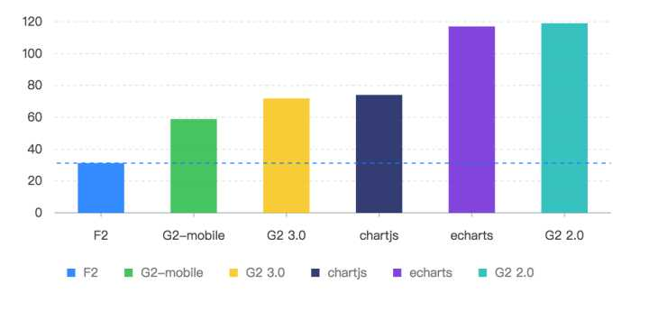

[AntV](https://antv.alipay.com/zh-cn/index.html)、[G2](https://antv.alipay.com/zh-cn/g2/3.x/index.html) 和 [Bizcharts](https://alibaba.github.io/BizCharts/index.html)
===

## AntV、G2、BizCharts 是什么？

#### AntV 与 G2

* AntV 是蚂蚁金服体验技术部团队提供的一套[数据可视化](https://baike.baidu.com/item/%E6%95%B0%E6%8D%AE%E5%8F%AF%E8%A7%86%E5%8C%96/1252367?fr=aladdin)方案。[AntV team](https://github.com/antvis)
* AntV 中主要包含 [G2](https://antv.alipay.com/zh-cn/g2/3.x/index.html)、[G6](https://antv.alipay.com/zh-cn/g6/1.x/index.html)、[F2](https://antv.alipay.com/zh-cn/f2/3.x/index.html) 及一套完整的**图表使用指引**和**可视化设计规范**
  * G2：数据驱动的高交互可视化**图形语法**，是图形语法在前端工程上的一个实现。G2 3.0 于 2017-11-22 正式开源（MIT），包括3个核心包 底层 Canvas 绘图库 [g](https://github.com/antvis/g)、数据处理库 [data-set](https://github.com/antvis/data-set)和上层的数据驱动交互式图形语法库 [g2](https://github.com/antvis/g2)。
  * G6：专注解决流程与关系分析场景的图表库
  * F2：适于对**性能、体积、扩展性**要求严苛场景下使用的**移动端图表库**（a canvas library which providing 2d draw for mobile）

1024 条数据的情况下折线图的性能对比（3.0 做了 Canvas 图层合并、数据处理 DateSet 模块外置，将数据处理与图表绘制解耦）：



#### 可视化图形语法

**数据可视化的目的** 在于用图形化的手段，清晰有效地传达和沟通信息，一图胜千言。

Leland Wilkinson 在上世纪90年代开发可视化软件时编写了[《The Grammar of Graphics》](https://book.douban.com/subject/10123863/)，用语法描述图形的产生，以自底向上的方式 **组织最基本的元素形成更高级的元素**。此后，开源社区逐渐诞生了对图形语法的各种语言版本实现： R 语言社区的 ggplot2；Python 技术栈实现的 Bokeh；基于 D3 的 Vega。G2 是目前 JavaScript 社区对《The Grammar of Graphics》还原度最高的实现，刚一开源就得到 Leland Wilkinson 本人的肯定。

图形语法的组成：https://antv.alipay.com/zh-cn/g2/3.x/tutorial/the-grammar-of-graphics.html#_图形语法的组成

和传统 **枚举图表类型** 的可视化工具相比，基于图形语法的可视化工具的特征是：生成每一个图形的过程就是组合不同的基础图形语法的过程。图形语法的灵活和强大之处就在于，我们只需要改动其中某一步的处理过程，就能得到完全不同的、全新的图表。

> 参考 [可视化图形语法概述](https://zhuanlan.zhihu.com/p/32178892?group_id=926791155145109504)

#### BizCharts

Anv 官推的基于 G2 的 React 图表库。

此外，[Viser](https://viserjs.github.io/) 对 G2 3.0 做了通用的抽象，已经支持对 React、Angular、Vue 三个框架的深度整合，对应的是 viser-react、viser-ng 和 viser-vue。

## G2 中的几个重要基础概念

#### G2 图表组成


#### DateSet

自 G2 3.0 版本开始，原先内置的数据处理模块 frame 从 G2 包中抽离出来，独立成为 DataSet 包。DataSet 的目标是为数据可视化场景提供 **状态驱动（state driven）** 的、丰富而强大的数据处理能力。

旧版本中，数据处理模块是和 G2 强耦合的，统计处理甚至会入侵到图形语法中。这会带来几方面的问题：

1. 功能受限于耦合，比较难升级
2. 数据处理是非常大的领域，内置的话扩展起来难免畏首畏尾，担心因此影响 G2 的体量
3. 耦合的情况下，给数据处理和图形语法两方面都带来了新的 **理解成本**。

> 基于这些考虑，AntV 团队认真梳理了底层架构，决定从 G2 中把数据处理部分抽离出来，封装成了一个专门的数据处理模块 DataSet。从此 **G2 内部不再有数据处理、布局和统计方面的代码包袱**，继续专注强化“高交互图形语法”方面的特长；而独立的 DataSet 模块则通过简单、强包容性的架构，以及 **状态量等策略** 扫除了升级扩展的障碍，得以从开源社区大量借力，不断丰富 **“数据驱动”** 这一特性的内涵。

G2 3.0 不强依赖 DataSet，在不需要复杂数据处理时可以不引入。

独立出来的 DataSet 主要提供三个方面的能力：

1. 数据连接（connector）：用于接入不同类型的数据，支持不限于 CSV/GeoJSON/Hierarchy 等；
2. 数据处理（transform）：进行数据变形、数据转换等，是 DataSet 的**核心功能**，负责和扩展了 G2 在**统计、布局、数据补全**等等方面的数据处理需求；
3. 状态量管理（state）：支持不同数据视图之间、数据视图和图表之间的通信；

###### `Connector` 负责导入和归一化数据（譬如导入 CSV 数据，导入 GeoJSON 数据等）

```js
dv.source(csvStr, {
  type: 'csv',   // 指定使用dsv connector
  delimiter: ',' // 指定分隔符
})
```

###### `Transform` 负责进行各种数据转换操作（譬如图布局、数据统计、数据补全等）

```js
// 统计某个维度下某个字段的值占总和的比例
// 每个不同的 dimension 下，field 值占总和的百分比
dv.transform({
  type: 'percent',         // 统计类型为 总和百分比
  field: 'sold',           // 是统计发生的字段（求和，求百分比），统计销量
  dimension: 'year',       // 统计的维度字段，每年的占比
  as: 'percent'            // 结果存储在 percent 字段
});

```

###### 在单个数据视图（DataView）的基础上增加了数据集（DataSet）的概念，通过统一的 DataSet 管理，实现了各个数据视图之间的状态同步和交互。

```js
// step1: 创建 DataSet, 指定状态量
const ds = new DataSet({
  state: {
    year: '2010'
  }
});

// step2: 创建 DataView
const dv = ds.createView().source(data);

dv.transform({
  type: 'filter',
  callback(row) { // 判断某一行是否保留，默认返回 true
    return row.year === ds.state.year;
  }
});

// step3: 引用 DataView
chart.source(dv);

// step4 更新状态量
ds.setState('year', '2012');
```

* [图表联动示例](https://antv.alipay.com/zh-cn/g2/3.x/tutorial/data-set.html#_%E5%9B%BE%E8%A1%A8%E8%81%94%E5%8A%A8%E7%A4%BA%E4%BE%8B)
* [DateSet 使用教程](https://antv.alipay.com/zh-cn/g2/3.x/tutorial/data-set.html)

#### 几何标记 Geom

G2 中并没有特定的图表类型（柱状图、散点图、折线图等）的概念，G2 生成的图表类型，主要由几何标记决定。几何标记用来描述 点、线、面这些几何图形。


业务中最常用的几何标记类型：

Geom | 图表类型 | 描述
-------- | --------| ----------
`point` | **点图、折线图中的点** | 点，用于绘制各种点图。
`line` | **折线图、曲线图**、阶梯线图 | 线，点按照 x 轴连接成一条线，构成线图。
`area` | **区域图（面积图）、层叠区域图**、区间区域图 | 填充线图跟坐标系之间构成区域图，也可以指定上下范围。
`interval` | **柱状图、饼图**、直方图、南丁格尔玫瑰图、条形环图（玉缺图）、漏斗图等 | 使用矩形或者弧形，用面积来表示大小关系的图形，一般构成柱状图、饼图等图表。

> 几何标记（Geom）和视觉通道构成了可视化编码，[G2 图表类型使用教程](https://antv.alipay.com/zh-cn/g2/3.x/tutorial/chart-type.html) 从 **Geom 数据维度、Geom 自由度、视觉通道、图形形状** 4个角度描述了 **“图表类型”** 在可视化框架中的实现思路。

#### 图形属性（视觉通道）

图形属性对应视觉编码中的 **视觉通道**，不同的几何标记拥有自己的图形属性。

G2 支持以下图形属性：

* position：位置，二维坐标系内映射至 x 轴、y 轴；
* color：颜色，包含了色调、饱和度和亮度；
* size：大小，不同的几何标记对大小的定义有差异；
* shape：形状，几何标记的形状决定了某个具体图表类型的表现形式，例如点图，可以使用圆点、三角形、图片表示；线图可以有折线、曲线、点线等表现形式；
* opacity：透明度，图形的透明度，这个属性从某种意义上来说可以使用颜色代替，需要使用 'rgba' 的形式，所以在 G2 中我们独立出来。

图形属性是属于每一个几何标记 geom（Geometry) 的，所以我们先要声明几何标记，然后再在该几何标记对象上进行图形属性的映射，Eg.

```js
chart.point().position('a*b').color('c');
```

> [G2 图形属性使用教程](https://antv.alipay.com/zh-cn/g2/3.x/tutorial/attr.html)

## AntV 功能亮点

#### 支持多种数据源的解析

独立的数据处理模块（DateSet）支持多种数据源的解析，可以将 [csv](https://zh.wikipedia.org/wiki/%E9%80%97%E5%8F%B7%E5%88%86%E9%9A%94%E5%80%BC)、dsv、GeoJSON 转换成标准 JSON

[Connector 数据接入](https://antv.alipay.com/zh-cn/g2/3.x/api/connector.html)

#### 多Y轴图表的良好支持


[如何绘制多 y 轴图表](https://antv.alipay.com/zh-cn/g2/3.x/tutorial/fqas.html#_如何绘制多-y-轴图表)

#### 事件完备，无限交互可能

AntV 3.0 版本中，图表上的 **任意元素** 均可捕获鼠标和触摸事件，提供了更精准的事件监听！

只需要在 chart 或者 view 上监听该元素对应的事件名即可（元素名+基础事件名的方式组合），Eg：

```js
// 监听坐标轴文本的鼠标事件
chart.on('axis-label:mouseenter', ev => {});
chart.on('axis-label:mouseleave', ev => {});
chart.on('axis-label:click', ev => {});
```

#### 自定义动画

AntV 3.0 动画模块也从底层做了深入的优化，支持自定义动画，也更加流畅。


#### 支持分面（Facet）图表

分面，将一份数据按照某个维度分隔成若干子集，然后创建一个图表的矩阵，将每一个数据子集绘制到图形矩阵的窗格中。


#### 支持图片导出

直接调用 `chart.downloadImage();` 即可导出图片。

[如何导出图片](https://antv.alipay.com/zh-cn/g2/3.x/tutorial/fqas.html#_%E5%A6%82%E4%BD%95%E5%AF%BC%E5%87%BA%E5%9B%BE%E7%89%87)

## 辅助阅读

* [AntV 3.0 — 三生万物](https://zhuanlan.zhihu.com/p/31452637)
