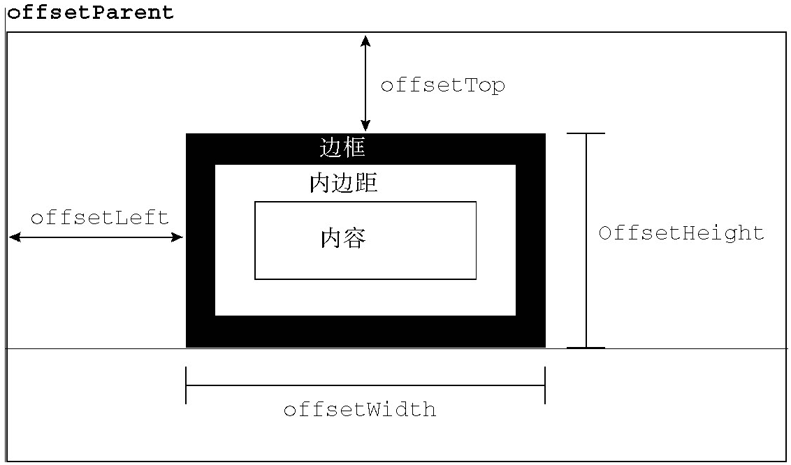

# DOM 重点知识汇总

> 2019.07.31 发布，最后更新于 2019.07.31
>
> 《JavaScript高级程序设计（第3版）》第 10 ~ 13 章笔记：DOM、DOM 扩展、DOM2 和 DOM 3、事件

DOM（文档对象模型）是针对HTML和XML文档的一个API（应用程序编程接口）。DOM描绘了一个层次化的节点树，允许开发人员添加、移除和修改页面的某一部分。

## （一）节点层次

### Node 类型

JavaScript 中的所有节点类型都继承自 `Node` 类型，因此所有节点类型都共享着相同的基本属性和方法。

每个节点都有一个 `nodeType` 属性，用于表明节点的类型。节点类型由在 `Node` 类型中定义的下列 12 个数值常量来表示，任何节点类型必居其一：

* `Node.ELEMENT_NODE`(1)
* `Node.ATTRIBUTE_NODE`(2)
* `Node.TEXT_NODE`(3)
* `Node.CDATA_SECTION_NODE`(4)
* `Node.ENTITY_REFERENCE_NODE`(5)
* `Node.ENTITY_NODE`(6)
* `Node.PROCESSING_INSTRUCTION_NODE`(7)
* `Node.COMMENT_NODE`(8)
* `Node.DOCUMENT_NODE`(9)
* `Node.DOCUMENT_TYPE_NODE`(10)
* `Node.DOCUMENT_FRAGMENT_NODE`(11)
* `Node.NOTATION_NODE`(12)

为了确保跨浏览器兼容，最好还是将 `nodeType` 属性与数字值进行比较，如下所示：

```js
if (someNode.nodeType == 1) { // 适用于所有浏览器
  alert('Node is an element.')
}
```

要了解节点的具体信息，可以使用 `nodeName` 和 `nodeValue` 这两个属性。这两个属性的值完全取决于节点的类型。对于元素节点，`nodeName` 中保存的始终都是元素的标签名，而 `nodeValue` 的值则始终为 `null`。

每个节点都有一个 `childNodes` 属性，其中保存着一个 `NodeList` 对象。`NodeList` 是一种类数组对象，用于保存一组有序的节点，可以通过位置来访问这些节点。

`NodeList` 对象的独特之处在于，它实际上是基于 DOM 结构动态执行查询的结果，因此 DOM 结构的变化能够自动反映在 `NodeList` 对象中。我们常说，`NodeList` 是有生命、有呼吸的对象，而不是在我们第一次访问它们的某个瞬间拍摄下来的一张快照。

每个节点都有一个 `parentNode` 属性，该属性指向文档树中的父节点。包含在 `childNodes` 列表中的所有节点都具有相同的父节点，因此它们的 `parentNode` 属性都指向同一个节点。此外，包含在 `childNodes` 列表中的每个节点相互之间都是同胞节点。通过使用列表中每个节点的 `previousSibling` 和 `nextSibling` 属性，可以访问同一列表中的其他节点。列表中第一个节点的 `previousSibling` 属性值为 `null`，而列表中最后一个节点的 `nextSibling` 属性的值同样也为 `null`。

父节点与其第一个和最后一个子节点之间也存在特殊关系。父节点的 `firstChild` 和 `lastChild` 属性分别指向其 `childNodes` 列表中的第一个和最后一个节点。


另外，`hasChildNodes()` 也是一个非常有用的方法，这个方法在节点包含一或多个子节点的情况下返回 `true`；应该说，这是比查询 `childNodes` 列表的 `length` 属性更简单的方法。所有节点都有的最后一个属性是 `ownerDocument`，该属性指向表示整个文档的文档节点。

因为关系指针都是只读的，所以 DOM 提供了一些操作节点的方法。其中，最常用的方法是 `appendChild()`，用于向 `childNodes` 列表的末尾添加一个节点。添加节点后，`childNodes` 的新增节点、父节点及以前的最后一个子节点的关系指针都会相应地得到更新。更新完成后，`appendChild()` 返回新增的节点。如果传入到 `appendChild()` 中的节点已经是文档的一部分了，那结果就是将该节点从原来的位置转移到新位置。

如果需要把节点放在 `childNodes` 列表中某个特定的位置上，而不是放在末尾，那么可以使用 `insertBefore()` 方法。这个方法接受两个参数：要插入的节点和作为参照的节点。插入节点后，被插入的节点会变成参照节点的前一个同胞节点（`previousSibling`），同时被方法返回。如果参照节点是 `null`，则 `insertBefore()` 与 `appendChild()` 执行相同的操作。

`replaceChild()` 方法接受两个参数：要插入的节点和要替换的节点。要替换的节点将由这个方法返回并从文档树中被移除，同时由要插入的节点占据其位置。

如果只想移除而非替换节点，可以使用 `removeChild()` 方法。这个方法接受一个参数，即要移除的节点。被移除的节点将成为方法的返回值。与使用 `replaceChild()` 方法一样，通过 `removeChild()` 移除的节点仍然为文档所有，只不过在文档中已经没有了自己的位置。

有两个方法是所有类型的节点都有的。第一个就是 `cloneNode()`，用于创建调用这个方法的节点的一个完全相同的副本。`cloneNode()` 方法接受一个布尔值参数，表示是否执行深复制。在参数为 `true` 的情况下，执行深复制，也就是复制节点及其整个子节点树；在参数为 `false` 的情况下，执行浅复制，即只复制节点本身。复制后返回的节点副本属于文档所有，但并没有为它指定父节点。因此，这个节点副本就成为了一个“孤儿”，除非通过 `appendChild()`、`insertBefore()` 或 `replaceChild()` 将它添加到文档中。

PS: `cloneNode()` 方法不会复制添加到 DOM 节点中的 JavaScript 属性，例如事件处理程序等。这个方法只复制特性、（在明确指定的情况下也复制）子节点，其他一切都不会复制。

我们要介绍的最后一个方法是 `normalize()`，这个方法唯一的作用就是处理文档树中的文本节点。由于解析器的实现或 DOM 操作等原因，可能会出现文本节点不包含文本，或者接连出现两个文本节点的情况。当在某个节点上调用这个方法时，就会在该节点的后代节点中查找上述两种情况。如果找到了空文本节点，则删除它；如果找到相邻的文本节点，则将它们合并为一个文本节点。

### Document 类型

JavaScript 通过 `Document` 类型表示文档。在浏览器中，`document` 对象是 `HTMLDocument`（继承自 `Document` 类型）的一个实例，表示整个 HTML 页面。`Document` 节点具有下列特征：

* `nodeType` 的值为 `9`；
* `nodeName` 的值为 `#document`；
* `nodeValue` 的值为 `null`；
* `parentNode` 的值为 `null`；
* `ownerDocument` 的值为 `null`；
* 其子节点可能是一个 `DocumentType`（最多一个）、`Element`（最多一个）、`ProcessingInstruction` 或 `Comment`

文档的子节点：

* 通过 `document.documentElement` 取得对 `<html>` 的引用；
* 通过 `document.body` 取得对 `<body>` 的引用；
* 通过 `document.doctype` 取得对 `<!DOCTYPE>` 的引用；

文档信息：

* 通过 `document.title` 取得或设置文档标题；
* 通过 `document.URL` 取得页面完整 URL（即地址栏中显示的 URL）；
* 通过 `document.domain` 取得页面域名（只有 `domain` 是可以设置的，但不能将这个属性设置为 URL 中不包含的域）；
* 通过 `document.referrer` 取得来源页面的 URL（链接到当前页面的那个页面的 URL）；

查找元素：

* `document.getElementById()`：接收一个参数：要取得的元素的 `ID`。如果找到相应的元素则返回该元素，如果不存在带有相应 `ID` 的元素，则返回 `null`；
* `document.getElementsByTagName()`：这个方法接受一个参数，即要取得元素的标签名，而返回的是包含零或多个元素的 `NodeList`。在 HTML 文档中，这个方法会返回一个 `HTMLCollection` 对象，作为一个“动态”集合。`HTMLCollection` 对象有个方法叫做 `namedItem()`，使用这个方法可以通过元素的 `name` 属性取得集合中的项。
* `document.getElementsByName()`：返回带有给定 `name` 属性的所有元素；

特殊集合：

除了属性和方法，`document` 对象还有一些特殊的集合。这些集合都是 `HTMLCollection` 对象，为访问文档常用的部分提供了快捷方式，包括：

* `document.anchors`：包含文档中所有带 `name` 属性的 `<a>` 元素；
* `document.applets`：包含文档中所有的 `<applet>` 元素，因为不再推荐使用 `<applet>` 元素，所以这个集合已经不建议使用了；
* `document.forms`，包含文档中所有的 `<form>` 元素，与 `document.getElementsByTagName("form")` 得到的结果相同；
* `document.images`，包含文档中所有的 `` 元素，与 `document.getElementsByTagName("img")` 得到的结果相同；
* `document.links`，包含文档中所有带 `href` 属性的 `<a>` 元素。

### Element 类型

除了 `Document` 类型之外，`Element` 类型就要算是 Web 编程中最常用的类型了。`Element` 类型用于表现 XML 或 HTML 元素，提供了对元素标签名、子节点及特性的访问。`Element` 节点具有以下特征：

* `nodeType` 的值为 `1`；
* `nodeName` 的值为元素的标签名，也可以使用 `tagName` 属性，两者返回值相同；
* `nodeValue` 的值为 `null`；
* `parentNode` 可能是 `Document` 或 `Element`；
* 其子节点可能是 `Element`、`Text`、`Comment`、`ProcessingInstruction`、`CDATASection` 或 `EntityReference`。

**HTML 元素**：

所有 HTML 元素都由 `HTMLElement` 类型表示，`HTMLElement` 类型直接继承自 `Element` 并添加了一些属性。添加的这些属性分别对应于每个 `HTML` 元素中都存在的下列标准特性（可以取得或设置它们）：

* `id`，元素在文档中的唯一标识符；
* `title`，有关元素的附加说明信息，一般通过工具提示条显示出来；
* `lang`，元素内容的语言代码，很少使用；
* `dir`，语言的方向，值为 `"ltr"`（left-to-right，从左至右）或 `"rtl"`（right-to-left，从右至左），也很少使用；
* `className`，与元素的 `class` 特性对应，即为元素指定的 CSS 类。没有将这个属性命名为 class，是因为 class 是 ECMAScript 的保留字；

以上特性对应如下例子中的 HTML 元素：

`<div id="myDiv" class="bd" title="Body text" lang="en" dir="ltr"></div>`

**取得与设置特性（属性）**：

每个元素都有一或多个特性，这些特性的用途是给出相应元素或其内容的附加信息。操作特性的 DOM 方法主要有三个：

* `getAttribute()`：通过 `getAttribute()` 方法也可以取得自定义特性（即标准 HTML 语言中没有的特性）的值。根据 HTML5 规范，自定义特性应该加上 `data-` 前缀以便验证。
* `setAttribute()`
* `removeAttribute()`

**`attributes` 属性**：

`Element` 类型是使用 `attributes` 属性的唯一一个 DOM 节点类型。`attributes` 属性中包含一个 `NamedNodeMap`，与 `NodeList` 类似，也是一个“动态”的集合。元素的每一个特性都由一个 `Attr` 节点表示，每个节点都保存在 `NamedNodeMap` 对象中。`NamedNodeMap` 对象拥有下列方法：

* `getNamedItem_(name)_`：返回 `nodeName` 属性等于 `name` 的节点；
* `removeNamedItem_(name)_`：从列表中移除 `nodeName` 属性等于 `name` 的节点；
* `setNamedItem_(node)_`：向列表中添加节点，以节点的 `nodeName` 属性为索引；
* `item_(pos)_`：返回位于数字 `pos` 位置处的节点。

**创建元素**：

使用 `document.createElement()` 方法可以创建新元素。这个方法只接受一个参数，即要创建元素的标签名。

1. 在使用 `createElement()` 方法创建新元素的同时，也为新元素设置了 `ownerDocument` 属性。此时，还可以操作元素的特性，为它添加更多子节点，以及执行其他操作；
2. 在新元素上设置这些特性只是给它们赋予了相应的信息。由于新元素尚未被添加到文档树中，因此设置这些特性不会影响浏览器的显示。要把新元素添加到文档树，可以使用 `appendChild()`、`insertBefore()` 或 `replaceChild()` 方法；
3. 一旦将元素添加到文档树中，浏览器就会立即呈现该元素。此后，对这个元素所作的任何修改都会实时反映在浏览器中。

### Text 类型

文本节点由 `Text` 类型表示，包含的是可以照字面解释的纯文本内容。纯文本中可以包含转义后的 HTML 字符，但不能包含 HTML 代码。`Text` 节点具有以下特征：

* `nodeType` 的值为 `3`；
* `nodeName` 的值为 `"#text"`；
* `nodeValue` 的值为节点所包含的文本；
* `parentNode` 是一个 `Element`；
* 不支持（没有）子节点。

可以通过 `nodeValue` 属性或 `data` 属性访问 `Text` 节点中包含的文本，这两个属性中包含的值相同。对 `nodeValue` 的修改也会通过 `data` 反映出来，反之亦然。使用下列方法可以操作节点中的文本：

* `appendData(text)`：将 `text` 添加到节点的末尾；
* `deleteData(offset, count)`：从 `offset` 指定的位置开始删除 `count` 个字符；
* `insertData(offset, text)`：在 `offset` 指定的位置插入 `text`；
* `replaceData(offset, count, text)`：用 `text` 替换从 `offset` 指定的位置开始到 `offset + count` 为止处的文本；
* `splitText(offset)`：从 `offset` 指定的位置将当前文本节点分成两个文本节点；
* `substringData(offset, count)`：提取从 `offset` 指定的位置开始到 `offset + count` 为止处的字符串；

除了这些方法之外，文本节点还有一个 `length` 属性，保存着节点中字符的数目。而且，`nodeValue.length` 和 `data.length` 中也保存着同样的值。

创建文本节点：

1. 可以使用 `document.createTextNode()` 创建新文本节点，这个方法接受一个参数——要插入节点中的文本。
2. 在创建新文本节点的同时，也会为其设置 `ownerDocument` 属性。不过，除非把新节点添加到文档树中已经存在的节点中，否则我们不会在浏览器窗口中看到新节点。

### Comment 类型

注释在 DOM 中是通过 `Comment` 类型来表示的。`Comment` 节点具有下列特征：

* `nodeType` 的值为 `8`；
* `nodeName` 的值为 `"#comment"`；
* `nodeValue` 的值是注释的内容；
* `parentNode` 可能是 `Document` 或 `Element`；
* 不支持（没有）子节点。

`Comment` 类型与 `Text` 类型继承自相同的基类，因此它拥有除 `splitText()` 之外的所有字符串操作方法。与 `Text` 类型相似，也可以通过 `nodeValue` 或 `data` 属性来取得注释的内容。另外，使用 `document.createComment()` 并为其传递注释文本也可以创建注释节点。

### CDATASection 类型

`CDATASection` 类型只针对基于 XML 的文档，表示的是 CDATA 区域。与 `Comment` 类似，`CDATASection` 类型继承自 `Text` 类型，因此拥有除 `splitText()` 之外的所有字符串操作方法。`CDATASection` 节点具有下列特征：

* `nodeType` 的值为 `4`；
* `nodeName` 的值为 `"#cdata-section"`；
* `nodeValue` 的值是 CDATA 区域中的内容；
* `parentNode` 可能是 `Document` 或 `Element`；
* 不支持（没有）子节点。

### DocumentType 类型

`DocumentType` 类型在 Web 浏览器中并不常用。`DocumentType` 包含着与文档的 `doctype` 有关的所有信息，它具有下列特征：

* `nodeType` 的值为 `10`；
* `nodeName` 的值为 `doctype` 的名称；
* `nodeValue` 的值为 `null`；
* `parentNode` 是 `Document`；
* 不支持（没有）子节点。

DOM1 级描述了 `DocumentType` 对象的3个属性：

* `name`：文档类型的名称；
* `entities`：由文档类型描述的实体的 `NamedNodeMap` 对象；
* `notations`：由文档类型描述的符号的 `NamedNodeMap` 对象；

通常，浏览器中的文档使用的都是 HTML 或 XHTML 文档类型，因而 `entities` 和 `notations` 都是空列表（列表中的项来自行内文档类型声明）。但不管怎样，只有 `name` 属性是有用的。这个属性中保存的是文档类型的名称，也就是出现在 `<!DOCTYPE` 之后的文本。以下面严格型 HTML 4.01 的文档类型声明为例：

`<!DOCTYPE HTML PUBLIC "-//W3C//DTD HTML 4.01//EN" "http://www.w3.org/TR/html4/strict.dtd">`

`DocumentType` 的 `name` 属性中保存的就是 `"HTML"`：

`alert(document.doctype.name); // "HTML"`

### DocumentFragment 类型

在所有节点类型中，只有 `DocumentFragment` 在文档中没有对应的标记。DOM 规定文档片段（document fragment）是一种“轻量级”的文档，可以包含和控制节点，但不会像完整的文档那样占用额外的资源。`DocumentFragment` 节点具有下列特征：

* `nodeType` 的值为 `11`；
* `nodeName` 的值为 `"#document-fragment"`；
* `nodeValue` 的值为 `null`；
* `parentNode` 的值为 `null`；
* 子节点可以是 `Element`、`ProcessingInstruction`、`Comment`、`Text`、`CDATASection` 或 `EntityReference`。

虽然不能把文档片段直接添加到文档中，但可以将它作为一个“仓库”来使用，即可以在里面保存将来可能会添加到文档中的节点。要创建文档片段，可以使用 `document.createDocumentFragment()` 方法。

文档片段继承了 `Node` 的所有方法，通常用于执行那些针对文档的 DOM 操作。如果将文档中的节点添加到文档片段中，就会从文档树中移除该节点，也不会从浏览器中再看到该节点。添加到文档片段中的新节点同样也不属于文档树。可以通过 `appendChild()` 或 `insertBefore()` 将文档片段中内容添加到文档中。在将文档片段作为参数传递给这两个方法时，实际上只会将文档片段的所有子节点添加到相应位置上；文档片段本身永远不会成为文档树的一部分。

**应用示例**：

`<ul id="myList"></ul>`

假设我们想为这个 `<ul>` 元素添加3个列表项。如果逐个地添加列表项，将会导致浏览器反复渲染（呈现）新信息。为避免这个问题，可以像下面这样使用一个文档片段来保存创建的列表项，然后再一次性将它们添加到文档中：

```js
var fragment = document.createDocumentFragment()
var ul = document.getElementById('myList')
var li = null

for (var i = 0; i < 3; i++) {
  li = document.createElement('li')
  li.appendChild(document.createTextNode('Item' + (i + 1)))
  fragment.appendChild(li)
}

ul.appendChild(fragment)
```

### Attr 类型

元素的特性在 DOM 中以 `Attr` 类型来表示。在所有浏览器中（包括 IE8），都可以访问 `Attr` 类型的构造函数和原型。从技术角度讲，特性就是存在于元素的 `attributes` 属性中的节点。特性节点具有下列特征：

* `nodeType` 的值为 `2`；
* `nodeName` 的值是特性的名称；
* `nodeValue` 的值是特性的值；
* `parentNode` 的值为 `null`；
* 在 HTML 中不支持（没有）子节点；
* 在 XML 中子节点可以是 `Text` 或 `EntityReference`。

尽管它们也是节点，但特性却不被认为是 DOM 文档树的一部分。开发人员最常使用的是 `getAttribute()`、`setAttribute()` 和`removeAttribute()` 方法，很少直接引用特性节点。

`Attr` 对象有3个属性：

* `name`：特性名称（与 `nodeName` 的值相同）；
* `value`：特性的值（与 `nodeValue` 的值相同）；
* `specified`：布尔值，用以区别特性是在代码中指定的，还是默认的；

## （二） DOM 操作技术

### 动态脚本

通过调用 `loadScript` 这个函数来加载外部 javascript 文件：

```js
function loadScript(url) {
  var script = document.createElement('script')
  script.type = 'text/javascript'
  script.src = url
  document.body.appendChild(script)
}
```

### 动态样式

与动态脚本类似，所谓动态样式是指在页面刚加载时不存在的样式；动态样式是在页面加载完成后动态添加到页面中的。

以下面这个典型的 `<link>` 元素为例：

`<link rel="stylesheet" type="text/css" href="styles.css">`

```js
function loadStyles(url) {
  var link = document.createElement('link')
  link.rel = 'stylesheet'
  link.type = 'text/javascript'
  var head = document.getElementByTagName('head')[0]
  head.appendChild(link)
}
```

### 操作表格

为方便构建表格，HTML DOM 为 `<table>`、`<tbody>` 和 `<tr>` 元素添加了一些属性和方法。

为 `<table>` 元素添加的属性和方法：

* `caption`：保存着对 `<caption>` 元素（如果有）的指针；
* `tBodies`：是一个 `<tbody>` 元素的 `HTMLCollection`；
* `tFoot`：保存着对 `<tfoot>` 元素（如果有）的指针；
* `tHead`：保存着对 `<thead>` 元素（如果有）的指针；
* `rows`：是一个表格中所有行的 `HTMLCollection`；
* `createTHead()`：创建 `<thead>` 元素，将其放到表格中，返回引用；
* `createTFoot()`：创建 `<tfoot>` 元素，将其放到表格中，返回引用；
* `createCaption()`：创建 `<caption>` 元素，将其放到表格中，返回引用；
* `deleteTHead()`：删除 `<thead>` 元素；
* `deleteTFoot()`：删除 `<tfoot>` 元素；
* `deleteCaption()`：删除 `<caption>` 元素；
* `deleteRow(_pos_)`：删除指定位置的行；
* `insertRow(_pos_)`：向 `rows` 集合中的指定位置插入一行；

为 `<tbody>` 元素添加的属性和方法：

* `rows`：保存着 `<tbody>` 元素中行的 `HTMLCollection`；
* `deleteRow(pos)`：删除指定位置的行；
* `insertRow(pos)`：向 `rows` 集合中的指定位置插入一行，返回对新插入行的引用；

为 `<tr>` 元素添加的属性和方法：

* `cells`：保存着 `<tr>` 元素中单元格的 `HTMLCollection`；
* `deleteCell(pos)`：删除指定位置的单元格；
* `insertCell(pos)`：向 `cells` 集合中的指定位置插入一个单元格，返回对新插入单元格的引用；

### 使用 NodeList

`NodeList`、`NamedNodeMap`、`HTMLCollection` 这三个集合都是动态的，每当文档结构发生变化时，它们都会得到更新。

一般来说，应该尽量减少访问 `NodeList` 的次数。因为每次访问 `NodeList`，都会运行一次基于文档的查询。所以，可以考虑将从 `NodeList` 中取得的值缓存起来。

下面例子中初始化了第二个变量 `len`。由于 `len` 中保存着对 `divs.length` 在循环开始时的一个快照，因此就可以避免无限循环问题：

```js
var divs = document.getElementByTagName('div'),
    i,
    len,
    div
for (i = 0, len = divs.length; i < len; i++) {
  div = document.createElement('div')
  document.body.appendChild(div)
}
```

理解 DOM 的关键，就是理解 DOM 对性能的影响。DOM 操作往往是 JavaScript 程序中开销最大的部分，而因访问 `NodeList` 导致的问题最多。`NodeList` 对象都是“动态的”，这就意味着每次访问 `NodeList` 对象，都会运行一次查询。有鉴于此，最好的办法就是尽量减少 `DOM` 操作。

## （三） DOM 扩展

### 选择符 API

Selectors API（www.w3.org/TR/selectors-api/）是由 W3C 发起制定的一个标准，致力于让浏览器原生支持 CSS 查询。

`querySelector()`：接收一个 CSS 选择符，返回与该模式匹配的第一个元素，如果没有找到匹配的元素，返回 `null`。

通过 `Document` 类型调用 `querySelector()` 方法时，会在文档元素的范围内查找匹配的元素。而通过 `Element` 类型调用 `querySelector()` 方法时，只会在该元素后代元素的范围内查找匹配的元素。

`querySelectorAll()`：接收的参数与 `querySelector()` 方法一样，都是一个 CSS 选择符，但返回的是所有匹配的元素而不仅仅是一个元素。这个方法返回的是一个 `NodeList` 的实例。

与 `querySelector()` 类似，能够调用 `querySelectorAll()` 方法的类型包括 `Document`、`DocumentFragment` 和 `Element`。

`matchesSelector()`：Selectors API Level 2 规范为 `Element` 类型新增了一个方法 `matchesSelector()`。这个方法接收一个参数，即 CSS 选择符，如果调用元素与该选择符匹配，返回 `true`；否则，返回 `false`。（这里补充 [MDN 上的方法描述](https://developer.mozilla.org/zh-CN/docs/Web/API/Element/matches)）

### 元素遍历

对于元素间的空格，IE9 及之前版本不会返回文本节点，而其他所有浏览器都会返回文本节点。这样，就导致了在使用 `childNodes` 和 `firstChild` 等属性时的行为不一致。为了弥补这一差异，而同时又保持 DOM 规范不变，Element Traversal 规范（www.w3.org/TR/ElementTraversal/）新定义了一组属性。

Element Traversal API 为 DOM 元素添加了以下 5 个属性：

* `childElementCount`：返回子元素（不包括文本节点和注释）的个数；
* `firstElementChild`：指向第一个子元素；`firstChild` 的元素版；
* `lastElementChild`：指向最后一个子元素；`lastChild` 的元素版；
* `previousElementSibling`：指向前一个同辈元素；`previousSibling` 的元素版；
* `nextElementSibling`：指向后一个同辈元素；`nextSibling` 的元素版；

### HTML5

#### 与类相关的扩充

为了让开发人员适应并增加对 `class` 属性的新认识，HTML5 新增了很多 API，致力于简化 CSS 类的用法。

1.`getElementsByClassName()` 方法

可以通过 `document` 对象及所有 HTML 元素调用该方法。`getElementsByClassName()` 方法接收一个参数，即一个包含一或多个类名的字符串，返回带有指定类的所有元素的 `NodeList`。传入多个类名时，类名的先后顺序不重要。Eg：

```js
//取得所有类中包含 "username" 和 "current" 的元素，类名的先后顺序无所谓
var allCurrentUsernames = document.getElementsByClassName("username current");

//取得 ID 为 "myDiv" 的元素中带有类名 "selected" 的所有元素
var selected = document.getElementById("myDiv").getElementsByClassName("selected");
```

2.`classList` 属性

HTML5 新增了一种操作类名的方式，可以让操作更简单也更安全，那就是为所有元素添加 `classList` 属性。这个 `classList` 属性是新集合类型 `DOMTokenList` 的实例。与其他 DOM 集合类似，`DOMTokenList` 有一个表示自己包含多少元素的 `length` 属性，而要取得每个元素可以使用 `item()` 方法，也可以使用方括号语法。此外，这个新类型还定义如下方法:

* `add(value)`：将给定的字符串值添加到列表中。如果值已经存在，就不添加了；
* `contains(value)`：表示列表中是否存在给定的值，如果存在则返回 `true`，否则返回 `false`；
* `remove(value)`：从列表中删除给定的字符串；
* `toggle(value)`：如果列表中已经存在给定的值，删除它；如果列表中没有给定的值，添加它`；

用例：

```js
// 删除 “disabled” 类
div.classList.remove('disabled')

// 添加 “current” 类
div.classList.add('current')

// 切换 “user” 类
div.classList.toggle('user')

// 确定元素中是否包含既定的类名
if (div.classLit.contains('bd') && !div.classList.contains('disabled')) {
  // 执行操作
}

// 迭代类名
for (var i = 0, len = div.classList.length; i < len; i++) {
  doSomething(div.classList[i])
}
```

有了 `classList` 属性，除非你需要全部删除所有类名，或者完全重写元素的 `class` 属性，否则也就用不到 `className` 属性了。

#### 焦点管理

HTML5 也添加了辅助管理 DOM 焦点的功能。首先就是 `document.activeElement` 属性，这个属性始终会引用 DOM 中当前获得了焦点的元素。元素获得焦点的方式有页面加载、用户输入（通常是通过按 Tab 键）和在代码中调用 `focus()` 方法。

默认情况下，文档刚刚加载完成时，`document.activeElement` 中保存的是 `document.body` 元素的引用。文档加载期间，`document.activeElement` 的值为 `null`。

另外就是新增了 `document.hasFocus()` 方法，这个方法用于确定文档是否获得了焦点。通过检测文档是否获得了焦点，可以知道用户是不是正在与页面交互。

查询文档获知哪个元素获得了焦点，以及确定文档是否获得了焦点，这两个功能最重要的用途是提高 Web 应用的无障碍性。无障碍 Web 应用的一个主要标志就是恰当的焦点管理，而确切地知道哪个元素获得了焦点是一个极大的进步，至少我们不用再像过去那样靠猜测了。

#### HTMLDocument 的变化

1.`readyState` 属性

`Document` 的 `readyState` 属性有两个可能的值：

* `loading`：正在加载文档；
* `complete`：已经加载完文档；

```js
if (document.readyState == 'complete') {
    //执行操作
}
```

2.兼容模式：`document.compatMode` 用来告诉开发人员浏览器采用的渲染模式是标准模式还是混杂模式。在标准模式下，`document.compatMode` 的值等于 `"CSS1Compat"`，而在混杂模式下，`document.compatMode` 的值等于 `"BackCompat"`。

3.`head` 属性：HTML5 新增了 `document.head` 属性，引用文档的 `<head>` 元素。要引用文档的 `<head>` 元素，可以结合使用这个属性和另一种后备方法：

`var head = document.head || document.getElementsByTagName("head")[0]`

#### 字符集属性

HTML5 新增了几个与文档字符集有关的属性。其中，`charset` 属性表示文档中实际使用的字符集，也可以用来指定新字符集。默认情况下，这个属性的值为 `"UTF-16"`，但可以通过 `<meta>`元素、响应头部或直接设置 `charset` 属性修改这个值。

另一个属性是 `defaultCharset`，表示根据默认浏览器及操作系统的设置，当前文档默认的字符集应该是什么。如果文档没有使用默认的字符集，那 `charset` 和 `defaultCharset` 属性的值可能会不一样。

#### 自定义数据属性

HTML5 规定可以为元素添加非标准的属性，但要添加前缀 `data-`，目的是为元素提供与渲染无关的信息，或者提供语义信息。

添加了自定义属性之后，可以通过元素的 `dataset` 属性来访问自定义属性的值。`dataset` 属性的值是 `DOMStringMap` 的一个实例，也就是一个名值对儿的映射。在这个映射中，每个 `data-name` 形式的属性都会有一个对应的属性，只不过属性名没有 `data-` 前缀（比如，自定义属性是 `data-myname`，那映射中对应的属性就是 `myname`）。

#### 插入标记

1.`innerHTML` 属性

在读模式下，`innerHTML` 属性返回与调用元素的所有子节点（包括元素、注释和文本节点）对应的 HTML 标记。在写模式下，`innerHTML` 会根据指定的值创建新的 DOM 树，然后用这个 DOM 树完全替换调用元素原先的所有子节点。

2.`outerHTML` 属性

在读模式下，`outerHTML` 返回调用它的元素及所有子节点的 HTML 标签。在写模式下，`outerHTML` 会根据指定的 HTML 字符串创建新的 DOM 子树，然后用这个 DOM 子树完全替换调用元素。

3.`insertAdjacentHTML()` 方法

它接收两个参数：插入位置和要插入的 HTML 文本。第一个参数必须是下列值之一：

* `"beforebegin"`，在当前元素之前插入一个紧邻的同辈元素；
* `"afterbegin"`，在当前元素之下插入一个新的子元素或在第一个子元素之前再插入新的子元素；
* `"beforeend"`，在当前元素之下插入一个新的子元素或在最后一个子元素之后再插入新的子元素；
* `"afterend"`，在当前元素之后插入一个紧邻的同辈元素。

4.内存与性能问题

在删除带有事件处理程序或引用了其他 JavaScript 对象子树时，就有可能导致内存占用问题。假设某个元素有一个事件处理程序（或者引用了一个 JavaScript 对象作为属性），在使用前述某个属性将该元素从文档树中删除后，元素与事件处理程序（或 JavaScript 对象）之间的绑定关系在内存中并没有一并删除。如果这种情况频繁出现，页面占用的内存数量就会明显增加。

因此，在使用 `innerHTML`、`outerHTML` 属性和 `insertAdjacentHTML()` 方法时，最好先手工删除要被替换的元素的所有事件处理程序和 JavaScript 对象属性。

一般来说，在插入大量新 HTML 标记时，使用 `innerHTML` 属性与通过多次 DOM 操作先创建节点再指定它们之间的关系相比，效率要高得多。这是因为在设置 `innerHTML` 或 `outerHTML` 时，就会创建一个 HTML 解析器。这个解析器是在浏览器级别的代码（通常是 C++ 编写的）基础上运行的，因此比执行 JavaScript 快得多。不可避免地，创建和销毁 HTML 解析器也会带来性能损失，所以最好能够将设置 `innerHTML` 或 `outerHTML` 的次数控制在合理的范围内。

#### scrollIntoView() 方法

`scrollIntoView()` 可以在所有 HTML 元素上调用，通过滚动浏览器窗口或某个容器元素，调用元素就可以出现在视口中。

如果给这个方法传入 `true` 作为参数，或者不传入任何参数，那么窗口滚动之后会让调用元素的顶部与视口顶部尽可能平齐。如果传入 `false` 作为参数，调用元素会尽可能全部出现在视口中，（可能的话，调用元素的底部会与视口顶部平齐。）不过顶部不一定平齐。

## （四） DOM2 和 DOM3

DOM1 级主要定义的是 HTML 和 XML 文档的底层结构。DOM2 和 DOM3 级则在这个结构的基础上引入了更多的交互能力，也支持了更高级的 XML 特性。为此，DOM2 和 DOM3 级分为许多模块（模块之间具有某种关联），分别描述了 DOM 的某个非常具体的子集。这些模块如下：

* DOM2 级核心（DOM Level 2 Core）：在1级核心基础上构建，为节点添加了更多方法和属性；
* DOM2 级视图（DOM Level 2 Views）：为文档定义了基于样式信息的不同视图；
* DOM2 级事件（DOM Level 2 Events）：说明了如何使用事件与 DOM 文档交互；
* DOM2 级样式（DOM Level 2 Style）：定义了如何以编程方式来访问和改变 CSS 样式信息；
* DOM2 级遍历和范围（DOM Level 2 Traversal and Range）：引入了遍历 DOM 文档和选择其特定部分的新接口；
* DOM2 级 HTML（DOM Level 2 HTML）：在1级 HTML 基础上构建，添加了更多属性、方法和新接口；

DOM2级和3级的目的在于扩展 DOM API，以满足操作 XML 的所有需求，同时提供更好的错误处理及特性检测能力。

### DOM 变化

#### 针对 XML 命名空间的变化

有了 XML 命名空间，不同 XML 文档的元素就可以混合在一起，共同构成格式良好的文档，而不必担心发生命名冲突。从技术上说，HTML 不支持 XML 命名空间，但 XHTML 支持 XML 命名空间。

命名空间要使用 `xmlns` 特性来指定。XHTML 的命名空间是 `http://www.w3.org/1999/xhtml`，在任何格式良好 XHTML 页面中，都应该将其包含在 `<html>` 元素中。要想明确地为 XML 命名空间创建前缀，可以使用 `xmlns` 后跟冒号，再后跟前缀。有时候为了避免不同语言间的冲突，也需要使用命名空间来限定特性：

```xhtml
<xhtml:html xmlns:xhtml="http://www.w3.org/1999/xhtml">
  <xhtml:head>
    <xhtml:title>Example XHTML page</xhtml:title>
  </xhtml:head>
  <xhtml:body xhtml:class="home">
    Hello World!
  </xhtml:body>
</xhtml:html>
```

#### 其他方面的变化

1.`DocumentType` 类型新增了3个属性：`publicId`、`systemId` 和 `internalSubset`。其中，前两个属性表示的是文档类型声明中的两个信息段，这两个信息段在 DOM1 级中是没有办法访问到的。

例如：`<!DOCTYPE HTML PUBLIC "-//W3C//DTD HTML 4.01//EN" "http://www.w3.org/TR/html4/strict.dtd"> [<!ELEMENT name (#PCDATA)>]`

* `publicId` 是 `"-//W3C//DTD HTML 4.01//EN"`
* `systemId` 是 `"http://www.w3.org/TR/html4/strict.dtd"`
* `internalSubset` 是 `"<!ELEMENT name (#PCDATA)>"`

这种内部子集（internal subset）在 HTML 中极少用到，在XML中可能会更常见一些。

2.`Document` 类型的变化

`Document` 类型的变化中唯一与命名空间无关的方法是 `importNode()`。这个方法的用途是从一个文档中取得一个节点，然后将其导入到另一个文档，使其成为这个文档结构的一部分

3.`Node` 类型的变化

`Node` 类型中唯一与命名空间无关的变化，就是添加了 `isSupported()` 方法。与 DOM1级为 `document.implementation` 引入的 `hasFeature()` 方法类似，`isSupported()` 方法用于确定当前节点具有什么能力。这个方法也接受相同的两个参数：特性名和特性版本号。如果浏览器实现了相应特性，而且能够基于给定节点执行该特性，`isSupported()` 就返回 `true`。

4.框架的变化

框架和内嵌框架分别用 `HTMLFrameElement` 和 `HTMLIFrameElement` 表示，它们在 DOM2 级中都有了一个新属性，名叫 `contentDocument`。这个属性包含一个指针，指向表示框架内容的文档对象。

### 样式

要确定浏览器是否支持 DOM2级 定义的 CSS 能力，可以使用下列代码：

```js
var supportsDOM2CSS = document.implementation.hasFeature("CSS", "2.0")
var supportsDOM2CSS2 = document.implementation.hasFeature("CSS2", "2.0")
```

任何支持 style 特性的 HTML 元素在 JavaScript 中都有一个对应的 `style` 属性。这个 `style` 对象是 `CSSStyleDeclaration` 的实例，包含着通过 HTML 的 `style` 特性指定的所有样式信息，但不包含与外部样式表或嵌入样式表经层叠而来的样式。

“DOM2级样式”规范还为 `style` 对象定义了一些属性和方法。这些属性和方法在提供元素的 `style` 特性值的同时，也可以修改样式。下面列出了这些属性和方法：

* `cssText`：如前所述，通过它能够访问到 `style` 特性中的 CSS 代码；
* `length`：应用给元素的 CSS 属性的数量；
* `parentRule`：表示 CSS 信息的 CSSRule 对象；
* `getPropertyCSSValue(propertyName)`：返回包含给定属性值的 CSSValue 对象；
* `getPropertyPriority(propertyName)`：如果给定的属性使用了 `!important` 设置，则返回 `"important"`；否则，返回空字符串；
* `getPropertyValue(propertyName)`：返回给定属性的字符串值；
* `item(index)`：返回给定位置的 CSS 属性的名称；
* `removeProperty(propertyName)`：从样式中删除给定属性；
* `setProperty(propertyName, value, priority)`：将给定属性设置为相应的值，并加上优先权标志（`"important"` 或者一个空字符串）；

虽然 `style` 对象能够提供支持 `style` 特性的任何元素的样式信息，但它不包含那些从其他样式表层叠而来并影响到当前元素的样式信息。“DOM2级样式”增强了 `document.defaultView`，提供了 `getComputedStyle()` 方法。这个方法接受两个参数：要取得计算样式的元素和一个伪元素字符串（例如 `":after"`）。如果不需要伪元素信息，第二个参数可以是 `null`。`getComputedStyle()` 方法返回一个 `CSSStyleDeclaration` 对象（与 `style` 属性的类型相同），其中包含当前元素的所有计算的样式。

### 元素大小

#### 偏移量

偏移量（offset dimension），包括元素在屏幕上占用的所有可见的空间。元素的可见大小由其高度、宽度决定，包括所有内边距、滚动条和边框大小（注意，不包括外边距）。通过下列4个属性可以取得元素的偏移量：

* `offsetHeight`：元素在垂直方向上占用的空间大小，以像素计。包括元素的高度、（可见的）水平滚动条的高度、上边框高度和下边框高度；
* `offsetWidth`：元素在水平方向上占用的空间大小，以像素计。包括元素的宽度、（可见的）垂直滚动条的宽度、左边框宽度和右边框宽度；
* `offsetLeft`：元素的左外边框至包含元素的左内边框之间的像素距离；
* `offsetTop`：元素的上外边框至包含元素的上内边框之间的像素距离；

其中，`offsetLeft` 和 `offsetTop` 属性与包含元素有关，包含元素的引用保存在 `offsetParent` 属性中。`offsetParent` 属性不一定与 `parentNode` 的值相等。例如，`<td>` 元素的 `offsetParent` 是作为其祖先元素的 `<table>` 元素，因为 `<table>` 是在 DOM 层次中距 `<td>` 最近的一个具有大小的元素。



要想知道某个元素在页面上的偏移量，将这个元素的 `offsetLeft` 和 `offsetTop` 与其 `offsetParent` 的相同属性相加，如此循环直至根元素，就可以得到一个基本准确的值：

```js
function getElementLeft(element) {
  var actualLeft = element.offsetLeft
  var current = element.offsetParent

  while(current !== null) {
    actualLeft += current.offsetLeft
    current = current.offsetParent
  }

  return actualLeft
}

function getElemetnTop(element) {
  var actualTop = element.offsetTop
  var current = element.offsetParent

  while(current !== null) {
    actualTop += current.offsetTop
    current = current.offsetParent
  }

  return actualTop
}
```

所有这些偏移量属性都是只读的，而且每次访问它们都需要重新计算。因此，应该尽量避免重复访问这些属性；如果需要重复使用其中某些属性的值，可以将它们保存在局部变量中，以提高性能。

#### 客户区大小

元素的客户区大小（client dimension），指的是元素内容及其内边距所占据的空间大小。有关客户区大小的属性有两个：`clientWidth` 和 `clientHeight`。其中，`clientWidth` 属性是元素内容区宽度加上左右内边距宽度；`clientHeight` 属性是元素内容区高度加上上下内边距高度。


从字面上看，客户区大小就是元素内部的空间大小，因此滚动条占用的空间不计算在内。

最常用到这些属性的情况，就是确定浏览器视口大小的时候：

```js
function getViewport() {
  if (document.compatMode === 'BackCompat') { // 在 IE7 之前的版本中
    return {
      width: document.body.clientWidth,
      height: document.body.clientHeight
    }
  } else {
    return {
      width: document.documentElement.clientWidth,
      height: document.documentElement.clientHeight
    }
  }
}
```

#### 滚动大小

滚动大小（scroll dimension），指的是包含滚动内容的元素的大小。有些元素（例如 `<html>` 元素），即使没有执行任何代码也能自动地添加滚动条；但另外一些元素，则需要通过 CSS 的 `overflow` 属性进行设置才能滚动。以下是4个与滚动大小相关的属性：

* `scrollHeight`：在没有滚动条的情况下，元素内容的总高度；
* `scrollWidth`：在没有滚动条的情况下，元素内容的总宽度；
* `scrollLeft`：被隐藏在内容区域左侧的像素数。通过设置这个属性可以改变元素的滚动位置；
* `scrollTop`：被隐藏在内容区域上方的像素数。通过设置这个属性可以改变元素的滚动位置；


#### 确定元素大小

IE、Firefox 3+、Safari 4+、Opera 9.5 及 Chrome 为每个元素都提供了一个 `getBoundingClientRect()` 方法。这个方法返回会一个矩形对象，包含4个属性：`left`、`top`、`right` 和 `bottom`。这些属性给出了元素在页面中相对于视口的位置。

### 遍历

“DOM2级遍历和范围”模块定义了两个用于辅助完成顺序遍历 DOM 结构的类型：`NodeIterator` 和 `TreeWalker`。这两个类型能够基于给定的起点对 DOM 结构执行深度优先（depth-first）的遍历操作。


1.`NodeIterator`

`NodeIterator` 类型是两者中比较简单的一个，可以使用 `document.createNodeIterator()` 方法创建它的新实例。这个方法接受下列4个参数：

* `root`：想要作为搜索起点的树中的节点；
* `whatToShow`：表示要访问哪些节点的数字代码；
* `filter`：是一个 `NodeFilter` 对象，或者一个表示应该接受还是拒绝某种特定节点的函数；
* `entityReferenceExpansion`：布尔值，表示是否要扩展实体引用。这个参数在 HTML 页面中没有用，因为其中的实体引用不能扩展。

2.`TreeWalker`

`TreeWalker` 是 `NodeIterator` 的一个更高级的版本。除了包括 `nextNode()` 和 `previousNode()` 在内的相同的功能之外，这个类型还提供了下列用于在不同方向上遍历 DOM 结构的方法：

* `parentNode()`：遍历到当前节点的父节点；
* `firstChild()`：遍历到当前节点的第一个子节点；
* `lastChild()`：遍历到当前节点的最后一个子节点；
* `nextSibling()`：遍历到当前节点的下一个同辈节点；
* `previousSibling()`：遍历到当前节点的上一个同辈节点。

创建 `TreeWalker` 对象要使用 `document.createTreeWalker()` 方法，这个方法接受的4个参数与 `document.createNodeIterator()` 方法相同：作为遍历起点的根节点、要显示的节点类型、过滤器和一个表示是否扩展实体引用的布尔值。

### 范围

为了让开发人员更方便地控制页面，“DOM2级遍历和范围”模块定义了“范围”（range）接口。通过范围可以选择文档中的一个区域，而不必考虑节点的界限（选择在后台完成，对用户是不可见的）。

可以使用 `createRange()` 来创建 DOM 范围：

`var range = document.createRange()`

与节点类似，新创建的范围也直接与创建它的文档关联在一起，不能用于其他文档。创建了范围之后，接下来就可以使用它在后台选择文档中的特定部分。而创建范围并设置了其位置之后，还可以针对范围的内容执行很多种操作，从而实现对底层 DOM 树的更精细的控制。

每个范围由一个 `Range` 类型的实例表示，这个实例拥有很多属性和方法。下列属性提供了当前范围在文档中的位置信息：

* `startContainer`：包含范围起点的节点（即选区中第一个节点的父节点）。
* `startOffset`：范围在 `startContainer` 中起点的偏移量。如果 `startContainer` 是文本节点、注释节点或 `CDATA`节点，那么 `startOffset` 就是范围起点之前跳过的字符数量。否则，`startOffset` 就是范围中第一个子节点的索引；
* `endContainer`：包含范围终点的节点（即选区中最后一个节点的父节点）；
* `endOffset`：范围在 `endContainer` 中终点的偏移量（与 `startOffset` 遵循相同的取值规则）；
* `commonAncestorContainer`：`startContainer` 和 `endContainer` 共同的祖先节点在文档树中位置最深的那个；

#### 用 DOM 范围实现简单选择

要使用范围来选择文档中的一部分，最简的方式就是使用 `selectNode()` 或 `selectNodeContents()`。这两个方法都接受一个参数，即一个 DOM 节点，然后使用该节点中的信息来填充范围。其中，`selectNode()` 方法选择整个节点，包括其子节点；而 `selectNodeContents()` 方法则只选择节点的子节点。

为了更精细地控制将哪些节点包含在范围中，还可以使用下列方法：

* `setStartBefore(refNode)`：将范围的起点设置在 `refNode` 之前，因此 `refNode` 也就是范围选区中的第一个子节点。同时会将 `startContainer` 属性设置为 `refNode.parentNode`，将 `startOffset` 属性设置为 `refNode` 在其父节点的 `childNodes` 集合中的索引；
* `setStartAfter(refNode)`：将范围的起点设置在 `refNode` 之后，因此 `refNode` 也就不在范围之内了，其下一个同辈节点才是范围选区中的第一个子节点。同时会将 `startContainer` 属性设置为 `refNode.parentNode`，将 `startOffset` 属性设置为 `refNode` 在其父节点的 `childNodes` 集合中的索引加1；
* `setEndBefore(refNode)`：将范围的终点设置在 `refNode` 之前，因此 `refNode` 也就不在范围之内了，其上一个同辈节点才是范围选区中的最后一个子节点。同时会将 `endContainer` 属性设置为 `refNode.parentNode`，将 `endOffset` 属性设置为 `refNode` 在其父节点的 `childNodes` 集合中的索引；
* `setEndAfter(refNode)`：将范围的终点设置在 `refNode` 之后，因此 `refNode` 也就是范围选区中的最后一个子节点。同时会将 `endContainer` 属性设置为 `refNode.parentNode`，将 `endOffset` 属性设置为 `refNode` 在其父节点的 `childNodes` 集合中的索引加1；

#### 用 DOM 范围实现复杂选择

要创建复杂的范围就得使用 `setStart()` 和 `setEnd()` 方法。这两个方法都接受两个参数：一个参照节点和一个偏移量值。对 `setStart()` 来说，参照节点会变成 `startContainer`，而偏移量值会变成 `startOffset`。对于 `setEnd()` 来说，参照节点会变成 `endContainer`，而偏移量值会变成 `endOffset`。

#### 操作 DOM 范围中的内容

* `deleteContents()`：从文档中删除范围所包含的内容；
* `extractContents()`：从文档中删除范围所包含的内容，区别是该方法会返回范围的文档片段。利用这个返回的值，可以将范围的内容插入到文档中的其他地方；
* `cloneContents()`：创建范围对象的一个副本；

#### 插入 DOM 范围中的内容

* `insertNode()`：使用 `insertNode()` 方法可以向范围选区的开始处插入一个节点；
* `surroundContents()`：环绕范围插入内容，这个方法接受一个参数，即环绕范围内容的节点；

#### 折叠 DOM 范围

使用 `collapse()` 方法来折叠范围，这个方法接受一个参数，一个布尔值，表示要折叠到范围的哪一端。参数 `true` 表示折叠到范围的起点，参数 `false` 表示折叠到范围的终点。要确定范围已经折叠完毕，可以检查 `collapsed` 属性。

#### 比较 DOM 范围

在有多个范围的情况下，可以使用 `compareBoundaryPoints()` 方法来确定这些范围是否有公共的边界（起点或终点）。这个方法接受两个参数：表示比较方式的常量值和要比较的范围。

表示比较方式的常量值如下所示：

* `Range.START_TO_START(0)`：比较第一个范围和第二个范围的起点；
* `Range.START_TO_END(1)`：比较第一个范围的起点和第二个范围的终点；
* `Range.END_TO_END(2)`：比较第一个范围和第二个范围的终点；
* `Range.END_TO_START(3)`：比较第一个范围的终点和第一个范围的起点；

`compareBoundaryPoints()` 方法可能的返回值如下：如果第一个范围中的点位于第二个范围中的点之前，返回 `-1`；如果两个点相等，返回 `0`；如果第一个范围中的点位于第二个范围中的点之后，返回 `1`。

#### 复制 DOM 范围

可以使用 `cloneRange()` 方法复制范围。这个方法会创建调用它的范围的一个副本。

`var newRange = range.cloneRange()`

新创建的范围与原来的范围包含相同的属性，而修改它的端点不会影响原来的范围。

#### 清理 DOM 范围

在使用完范围之后，最好是调用 `detach()` 方法，以便从创建范围的文档中分离出该范围。调用 `detach()` 之后，就可以放心地解除对范围的引用，从而让垃圾回收机制回收其内存了。

## （五）事件

### 事件流

事件流描述的是从页面中接收事件的顺序。“DOM2级事件”规定的事件流包括三个阶段：

1. 事件捕获阶段：为截获事件提供了机会；
2. 处于目标阶段；
3. 事件冒泡阶段：可以在这个阶段对事件做出响应；

### 事件处理程序

“DOM2级事件”定义了两个方法，用于处理指定和删除事件处理程序的操作：`addEventListener()` 和 `removeEventListener()`。所有 DOM 节点中都包含这两个方法，并且它们都接受3个参数：要处理的事件名、作为事件处理程序的函数和一个布尔值。最后这个布尔值参数如果是 `true`，表示在捕获阶段调用事件处理程序；如果是 `false`，表示在冒泡阶段调用事件处理程序。

通过 `addEventListener()` 添加的事件处理程序只能使用 `removeEventListener()` 来移除；移除时传入的参数与添加处理程序时使用的参数相同。这也意味着通过 `addEventListener()` 添加的匿名函数将无法移除。

### 事件对象

在触发 DOM 上的某个事件时，会产生一个事件对象 `event`，这个对象中包含着所有与事件有关的信息。包括导致事件的元素、事件的类型以及其他与特定事件相关的信息。

兼容 DOM 的浏览器会将一个 `event` 对象传入到事件处理程序中。

`event` 对象包含与创建它的特定事件有关的属性和方法。触发的事件类型不一样，可用的属性和方法也不一样。不过，所有事件都会有下表列出的成员：

| 属性/方法 | 类型 | 读/写 | 说明 |
| -------- | --- | ---- | ---- |
| bubbles | Boolean | 只读 | 表明事件是否冒泡 |
| cancelable | Boolean | 只读 | 表明是否可以取消事件的默认行为 |
| currentTarget | Element | 只读 | 某事件处理程序当前正在处理事件的那个元素 |
| defaultPrevented | Boolean | 只读 | 为 `true` 表示已经调用了 `preventDefault()` |
| detail | Integer | 只读 | 与事件相关的细节信息 |
| eventPhase | Integer | 只读 | 调用事件处理程序的阶段：1 表示捕获阶段，2 表示“处于目标”，3 表示冒泡阶段 |
| preventDefault() | Function | 只读 | 取消事件的默认行为。如果 `cancelable` 是 `true`，则可以使用这个方法 |
| stopImmediatePropagation() | Function | 只读 | 取消事件进一步捕获或冒泡，同时组织任何事件处理程序被调用 |
| stopPropagation() | Function | 只读 | 取消事件进一步的捕获或冒泡。如果 `bubbles` 为 `true`，则可以使用这个方法 |
| target | Element | 只读 | 事件的目标 |
| trusted | Boolean | 只读 | 为 `true` 表示事件是浏览器生成的。为 `false` 表示事件是由开发人员通过 `JavaScript` 创建的 |
| type | String | 只读 | 被触发的事件的类型 |
| view | AbstractView | 只读 | 与事件关联的抽象视图。等同于发生事件的 `window` 对象 |

在事件处理程序内部，对象 `this` 始终等于 `currentTarget` 的值，而 `target` 则只包含事件的实际目标。如果直接将事件处理程序指定给了目标元素，则 `this`、`currentTarget` 和 `target` 包含相同的值。

### 事件类型

“DOM3级事件”规定了以下几类事件：

* UI（User Interface）事件，当用户与页面上的元素交互时触发；
* 焦点事件，当元素获得或失去焦点时触发；
* 鼠标事件，当用户通过鼠标在页面上执行操作时触发；
* 滚轮事件，当使用鼠标滚轮（或类似设备）时触发；
* 文本事件，当在文档中输入文本时触发；
* 键盘事件，当用户通过键盘在页面上执行操作时触发；
* 合成事件，当为 IME（Input Method Editor，输入法编辑器）输入字符时触发；
* 变动（mutation）事件，当底层 DOM 结构发生变化时触发；
* 变动名称事件，当元素或属性名变动时触发。此类事件已经废弃，没有任何浏览器实现他们。

### 内存和性能

在 JavaScript 中，添加到页面上的事件处理程序数量将直接关系到页面的整体运行性能。导致这一问题的原因是多方面的。首先，每个函数都是对象，都会占用内存；内存中的对象越多，性能就越差。其次，必须事先指定所有事件处理程序而导致的 DOM 访问次数，会延迟整个页面的交互就绪时间。

事件委托：

对“事件处理程序过多”问题的解决方案就是事件委托。事件委托利用了事件冒泡，只指定一个事件处理程序，就可以管理某一类型的所有事件。

例如，`click` 事件会一直冒泡到 `document` 层次。也就是说，我们可以为整个页面指定一个 `onclick` 事件处理程序，而不必给每个可单击的元素分别添加事件处理程序。以下面的 HTML 代码为例：

```html
<ul id="myLinks">
  <li id="goSomeWhere">Go somewhere</li>
  <li id="doSomething">Do Something</li>
  <li id="sayHi">Say hi</li>
</ul>
```

若要为每个 `<li>` 添加点击的事件处理程序，使用事件委托，只需在 DOM 树中尽量最高的层次上添加一个事件处理程序：

```js
var list = document.getElementById('myLinks')

EventUtil.addHandler(list, 'click', function(event) {
  event = EventUtil.getEvent(event)
  var target = EventUtil.getTarget(event)

  switch(target.id) {
    case 'doSomething':
      document.title = "I changed the document's title"
      break
    case 'goSomeWhere':
      location.href = 'http://www.wrox.com'
      break
    case 'sayHi':
      alert('hi')
      break
  }
})
```

与未使用事件委托的代码对比，会发现这段代码的事前消耗更低，因为只取得了一个 DOM 元素，只添加了一个事件处理程序。虽然对用户来说最终的结果相同，但这种技术需要占用的内存更少。所有用到按钮的事件（多数鼠标事件和键盘事件）都适合采用事件委托技术。

如果可行的话，也可以考虑为 `document` 对象添加一个事件处理程序，用以处理页面上发生的某种特定类型的事件。这样做与采取传统的做法相比具有如下优点：

* `document` 对象很快就可以访问，而且可以在页面生命周期的任何时点上为它添加事件处理程序（无需等待 `DOMContentLoaded` 或 `load` 事件）。换句话说，只要可单击的元素呈现在页面上，就可以立即具备适当的功能；
* 在页面中设置事件处理程序所需的时间更少。只添加一个事件处理程序所需的 DOM 引用更少，所花的时间也更少；
* 整个页面占用的内存空间更少，能够提升整体性能；

最适合采用事件委托技术的事件包括 `click`、`mousedown`、`mouseup`、`keydown`、`keyup` 和 `keypress`。虽然 `mouseover` 和 `mouseout` 事件也冒泡，但要适当处理它们并不容易，而且经常需要计算元素的位置。（因为当鼠标从一个元素移到其子节点时，或者当鼠标移出该元素时，都会触发 `mouseout` 事件。）

每当将事件处理程序指定给元素时，运行中的浏览器代码与支持页面交互的 JavaScript 代码之间就会建立一个连接。这种连接越多，页面执行起来就越慢。如前所述，可以采用事件委托技术，限制建立的连接数量。另外，在不需要的时候移除事件处理程序，也是解决这个问题的一种方案。内存中留有那些过时不用的“空事件处理程序”（dangling event handler），也是造成 Web 应用程序内存与性能问题的主要原因。

在两种情况下，可能会造成上述问题。第一种情况就是从文档中移除带有事件处理程序的元素时。这可能是通过纯粹的 DOM 操作，例如使用 `removeChild()` 和 `replaceChild()` 方法，但更多地是发生在使用 `innerHTML` 替换页面中某一部分的时候。如果带有事件处理程序的元素被 `innerHTML` 删除了，那么原来添加到元素中的事件处理程序极有可能无法被当作垃圾回收。如果你知道某个元素即将被移除，那么最好手工移除事件处理程序：

```html
<div id="myDiv">
  <input type="button" value="Click Me" id="myBtn">
</div>
<script type="text/javascript">
  var btn = document.getElementById('myBtn')
  btn.onClick = function() {
    // 先执行某些操作
    btn.onClick = null // 移除事件处理程序
    document.getElementById('myDiv').innerHTML = 'Processing...'
  }
</script>
```

导致“空事件处理程序”的另一种情况，就是卸载页面的时候。一般来说，最好的做法是在页面卸载之前，先通过 `onunload` 事件处理程序移除所有事件处理程序。在此，事件委托技术再次表现出它的优势——需要跟踪的事件处理程序越少，移除它们就越容易。对这种类似撤销的操作，我们可以把它想象成：只要是通过 `onload` 事件处理程序添加的东西，最后都要通过 `onunload` 事件处理程序将它们移除。

### 模拟事件

事件，就是网页中某个特别值得关注的瞬间。事件经常由用户操作或通过其他浏览器功能来触发。但很少有人知道，也可以使用 JavaScript 在任意时刻来触发特定的事件，而此时的事件就如同浏览器创建的事件一样。也就是说，这些事件该冒泡还会冒泡，而且照样能够导致浏览器执行已经指定的处理它们的事件处理程序。在测试 Web 应用程序，模拟触发事件是一种极其有用的技术。

可以在 `document` 对象上使用 `createEvent()` 方法创建 `event` 对象。这个方法接收一个参数，即表示要创建的事件类型的字符串。这个字符串可以是下列几字符串之一：

* `UIEvent`：一般化的 UI 事件。鼠标事件和键盘事件都继承自 UI 事件；
* `MouseEvent`：一般化的鼠标事件；
* `MutationEvent`：一般化的 DOM 变动事件；
* `KeyboardEvent`：键盘事件；
* `CustomEvent`：自定义事件；

在创建了 `event` 对象之后，还需要使用与事件有关的信息对其进行初始化。每种类型的 `event` 对象都有一个特殊的方法，为它传入适当的数据就可以初始化该 `event` 对象。不同类型的这个方法的名字也不相同，具体要取决于 `createEvent()` 中使用的参数。

模拟事件的最后一步就是触发事件。这一步需要使用 `dispatchEvent()` 方法，所有支持事件的 DOM 节点都支持这个方法。调用 `dispatchEvent()` 方法时，需要传入一个参数，即表示要触发事件的 `event` 对象。触发事件之后，该事件就跻身“官方事件”之列了，因而能够照样冒泡并引发相应事件处理程序的执行。

#### 模拟鼠标事件

创建鼠标事件对象的方法是为 `createEvent()` 传入字符串 `"MouseEvent"`。返回的对象有一个名为 `initMouseEvent()` 方法，用于指定与该鼠标事件有关的信息。这个方法接收15个参数，分别与鼠标事件中每个典型的属性一一对应；这些参数的含义如下：

1. `type`（字符串）：表示要触发的事件类型，例如 `"click"`；
2. `bubbles`（布尔值）：表示事件是否应该冒泡。为精确地模拟鼠标事件，应该把这个参数设置为 `true`；
3. `cancelable`（布尔值）：表示事件是否可以取消。为精确地模拟鼠标事件，应该把这个参数设置为 `true`；
4. `view`（AbstractView）：与事件关联的视图。这个参数几乎总是要设置为 `document.defaultView`；
5. `detail`（整数）：与事件有关的详细信息。这个值一般只有事件处理程序使用，但通常都设置为 `0`；
6. `screenX`（整数）：事件相对于屏幕的 X 坐标；
7. `screenY`（整数）：事件相对于屏幕的 Y 坐标；
8. `clientX`（整数）：事件相对于视口的 X 坐标；
9. `clientY`（整数）：事件想对于视口的 Y 坐标；
10. `ctrlKey`（布尔值）：表示是否按下了 Ctrl 键。默认值为 `false`；
11. `altKey`（布尔值）：表示是否按下了 Alt 键。默认值为 `false`；
12. `shiftKey`（布尔值）：表示是否按下了 Shift 键。默认值为 `false`；
13. `metaKey`（布尔值）：表示是否按下了 Meta 键。默认值为 `false`；
14. `button`（整数）：表示按下了哪一个鼠标键。默认值为 `0`；
15. `relatedTarget`（对象）：表示与事件相关的对象。这个参数只在模拟 `mouseover` 或 `mouseout` 时使用；

显而易见，`initMouseEvent()` 方法的这些参数是与鼠标事件的 `event` 对象所包含的属性一一对应的。其中，前4个参数对正确地激发事件至关重要，因为浏览器要用到这些参数；而剩下的所有参数只有在事件处理程序中才会用到。当把 `event` 对象传给 `dispatchEvent()` 方法时，这个对象的 `target` 属性会自动设置。Eg：

```js
var btn = document.getElementById('myBtn')

// 创建事件对象
var event = document.createEvent('MouseEvent')

// 初始化事件对象
event.initMouseEvent('click', true, true, document.defaultView, 0, 0, 0, 0, 0, false, false, false, false, 0, null)

// 触发事件
btn.dispatchEvent(event)
```

#### 模拟键盘事件

DOM3级规定，调用 `createEvent()` 并传入 `"KeyboardEvent"` 就可以创建一个键盘事件。返回的事件对象会包含一个 `initKeyEvent()` 方法，这个方法接收下列参数：

1. `type`（字符串）：表示要触发的事件类型，如 `"keydown"`；
2. `bubbles`（布尔值）：表示事件是否应该冒泡；
3. `cancelable`（布尔值）：表示事件是否可以取消。为精确模拟鼠标事件，应该设置为 `true`；
4. `view`（AbstractView）：与事件关联的视图。这个参数几乎总是要设置为 `document.defaultView`；
5. `key`（布尔值）：表示按下的键的键码；
6. `location`（整数）：表示按下了哪里的键。`0` 表示默认的主键盘，`1` 表示左，`2` 表示右，`3` 表示数字键盘，`4` 表示移动设备（即虚拟键盘），`5` 表示手柄；
7. `modifiers`（字符串）：空格分隔的修改键列表，如 `"Shift"`；
8. `repeat`（整数）：在一行中按了这个键多少次；

由于 DOM3级 不提倡使用 `keypress` 事件，因此只能利用这种技术来模拟 `keydown` 和 `keyup` 事件。

#### 自定义 DOM 事件

DOM3级 还定义了“自定义事件”。自定义事件不是由 DOM 原生触发的，它的目的是让开发人员创建自己的事件。要创建新的自定义事件，可以调用 `createEvent("CustomEvent")`。返回的对象有一个名为 `initCustomEvent()` 的方法，接收如下4个参数：

1. `type`（字符串）：触发的事件类型，例如 `"keydown"`；
2. `bubbles`（布尔值）：表示事件是否应该冒泡；
3. `cancelable`（布尔值）：表示事件是否可以取消；
4. `detail`（对象）：任意值，保存在 `event` 对象的 `detail` 属性中；

可以像分派其他事件一样在 DOM 中分派创建的自定义事件对象。例如：

```js
var div = document.getElementById('myDiv'),
    event

EventUtil.addHandler(div, 'myevent', function(event) {
  alert('DIV: ' + event.detail)
})

EventUtil.addHandler(document, 'myevent', function(event) {
  alert('Document: ' + event.detail)
})

if (document.implementation.hasFeature('CustomEvents', 3.0)) {
  event = document.createEvent('CustomEvent')
  event.initCustomEvent('myevent', true, false, 'Hello world!')
  div.dispatchEvent(event)
}
```
